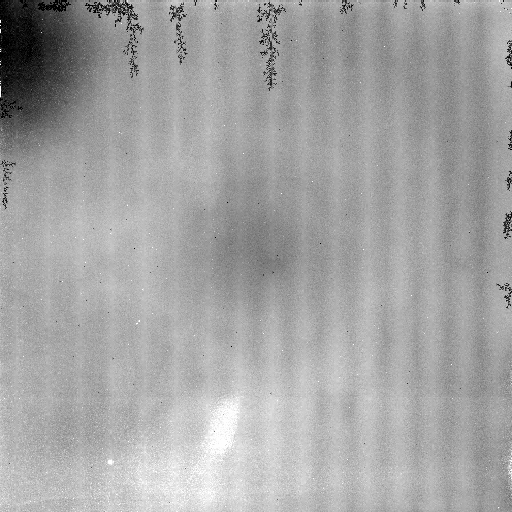

Single pixel reset analysis script
==================================

The single pixel reset (SPR) technique was applied in the Detector Characterization Laboratory (DCL) during acceptance and triplet testing of the Roman detectors. The technique resets 1 out of every 64 pixels (every 8 rows and every 8 columns) to a different voltage to measure cross-talk. This provides maps of the inter-pixel capacitance (IPC).

Interfaces
----------

There are two types of interfaces: the command line (best if calling from a terminal or bash script) and the dictionary (best if calling from inside Python).

A terminal run would be something like::

  python -m solid_waffle.spr_reduce \
    swtest/20191007_95k_1p1m0p1_sp_delrst0p20_20829_001.fits \
    swtest/out2 \
    -f=4 -n=5 -nd=5 -i -p=1 \
    -d=swtest/20191018_95K_1p1m0p1_ch0_1400nm_gr3_filt5_shutter_closed_20829_001.fits

Here:

* ``swtest/20191007_95k_1p1m0p1_sp_delrst0p20_20829_001.fits`` is the first input file (these are cubes with 2 frames, the "before" and "after" reset).

* ``swtest/out2`` is the output stem (i.e., files will be written to ``swtest/out2_*``; see `outputs <#outputs>`_).

* Everything else is an option (see `below <#options>`_ for a complete list). In this case, ``-f=4`` sets the file format to type 4; ``-n=5`` indicates that 5 single pixel reset exposures will be used (the ``..._001.fits`` becomes ``..._002.fits``, then ``..._003.fits``, etc.); ``-nd=5`` tells us to use 5 dark files for masking starting with the file in the ``-d`` keyword; ``-i`` tells us to interpolate over bad pixels when making the IPC map; and ``-p=1`` tells us to use pattern #1.

The dictionary method that would have the same effect is::

  from solid_waffle.spr_reduce import run_spr_reduce

  run_spr_reduce({
      "IN": "swtest/20191007_95k_1p1m0p1_sp_delrst0p20_20829_001.fits",
      "OUT": "swtest/out2",
      "-f": 4,
      "-n": 5,
      "-nd": 5,
      "-i": True,
      "-p": 1,
      "-d": "swtest/20191018_95K_1p1m0p1_ch0_1400nm_gr3_filt5_shutter_closed_20829_001.fits"
  })

Here the ``IN`` and ``OUT`` keys denote the input file and output stem; and the other command line options are given as keyword/value pairs. Options like ``-i`` that do not come with a value are simply given the value ``True`` to turn them on in the dictionary form.

Options
-------

The full list of options is:

* ``-f=<format>`` : controls input format (see `script information <ScriptInformation.rst#format>`_ for options)

* ``-n=<nfile>`` : controls number of files used (assumed sequential numbering if n>=2)

* ``-p=<pattern>`` : controls pattern number

* ``-d=<dark file>`` : dark data cube, same format, used for masking

* ``-nd=<ndarks>`` : controls number of dark files used (assumed sequential numbering if n>=2)

* ``-sca=<scanum>`` : SCA number (for output)

* ``-sd`` : if set, subtract dark (not recommended at this time, hasn't worked as well as we had hoped)

* ``-i`` : if set, interpolate masked pixels

* ``-a=<parameter>`` : alternate file naming scheme. The options are:

  * ``-a=0`` : most general name. In this case, the input file name is treated as a regular expression, i.e.,
    ``myfile_{:03d}.fits^5`` will be interpreted as the first file being ``myfile_005.fits``, then the second
    is ``myfile_006.fits``, and so on.

  * ``-a=1`` : default DCL numbering scheme, in which the first file is ``..._001.fits``, and then the subsequent
    files replace the ending: ``..._002.fits``, ``..._003.fits``, and so on.

  * ``-a=2`` : alternative including "_1_" in the file name (only needed for some cases).

* ``-nl=
`` : summary file for non-linearity information.

Outputs
-------

The main output generated is the ``*_alpha.fits`` image. This is an image of shape ``(13, N//dy, N//dx)``, where ``N`` is the side length of the detector array; and ``dx`` and ``dy`` are the spacings of the reset pixels (depending on the pattern given in ``-p``, usually 8 in the DCL tests). The first axis has the ordering (also given in the FITS header):

#. horizontal alpha (average left & right)
#. vertical alpha (average up & down)
#. diagonal alpha (average all 4 directions)
#. coupling to ``dx=+1, dy= 0`` ("east")
#. coupling to ``dx=+1, dy=+1`` ("northeast")
#. coupling to ``dx= 0, dy=+1`` ("north")
#. coupling to ``dx=-1, dy=+1`` ("northwest")
#. coupling to ``dx=-1, dy= 0`` ("west")
#. coupling to ``dx=-1, dy=-1`` ("southwest")
#. coupling to ``dx= 0, dy=-1`` ("south")
#. coupling to ``dx=+1, dy=-1`` ("southeast")
#. nearest neighbor alpha (average all 4 cardinal nearest neighbors)
#. mask (0 = normal, 1 = masked), not foolproof
                     
Note that these slices are 1--13 as displayed in ds9, but are 0--12 if indexed within Python or C.

Here is an example of slice 12 (nearest neighbor alpha) for SCA 20829:

There are two ancillary files:

* ``*_sprmean.fits`` : The NxN difference image of before and after SPR.

* ``*_darkmean.fits`` : The NxN dark map used for constructing the mask.

